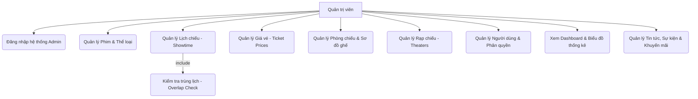
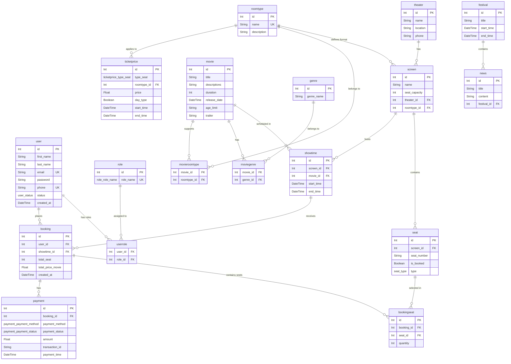
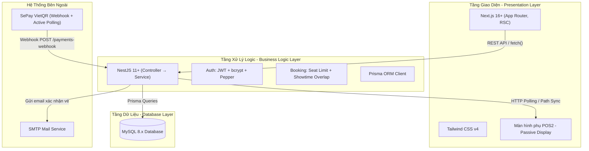

# KỊCH BẢN THUYẾT TRÌNH DỰ ÁN MTBA (Movie Ticket Booking App)

---

## Nội dung 1: Lời mở đầu (Hook & Khởi động)

**Kính chào Hội đồng Giám khảo/Quý Thầy Cô và các bạn sinh viên/khán giả đang có mặt trong buổi bảo vệ/thuyết trình ngày hôm nay.**

*Kính thưa quý vị,*
Chắc hẳn ở đây, hầu hết chúng ta đều đã từng ít nhất một lần đặt vé xem phim qua các ứng dụng như CGV, Lotte hay Galaxy. Và không ít lần chúng ta gặp phải những trải nghiệm "cười ra nước mắt": Đang thanh toán thì app bị văng, chuyển khoản xong tiền bị trừ nhưng vé thì không thấy đâu, hay khi ra quầy mua vé trực tiếp thì nhân viên phải xoay vội cái màn hình hoặc in tạm một tờ giấy có mã QR mờ tịt để chúng ta quét thanh toán.

Những "điểm nghẽn" (pain-points) nhỏ đó không chỉ gây khó chịu cho khách hàng mà còn làm tăng chi phí vận hành và chăm sóc khách hàng cho các rạp phim.

Từ chính những trăn trở về trải nghiệm thực tế đó, nhóm chúng em đã nghiên cứu và phát triển dự án **MTBA - Movie Ticket Booking App**.

---

## Nội dung 2: Mục tiêu & Phạm vi Dự án (Project Scope)

### 2.1. Mô tả ngắn gọn dự án

**MTBA - Movie Ticket Booking App** là một nền tảng trực tuyến toàn diện được thiết kế nhằm phục vụ nhu cầu đặt vé của khách hàng và tối ưu hóa quy trình quản lý rạp chiếu phim.

**Hệ thống này làm gì?**

* **Đối với Khách hàng**: Cho phép duyệt phim đang chiếu/sắp chiếu, xem thông tin chi tiết (trailer, diễn viên), chọn ghế trống trên sơ đồ trực quan và thanh toán qua VietQR. Sau khi đặt thành công, hệ thống tự động gửi email xác nhận kèm mã QR vé.
* **Đối với Nhân viên tại quầy (POS)**: Hỗ trợ đặt vé trực tiếp cho khách và đồng bộ hiển thị màn hình phụ POS2 một chiều — khách hàng tự đối chiếu thông tin, không gây lỗi lặp điều hướng vô hạn.
* **Đối với Quản trị viên (Admin)**: Cung cấp Dashboard thống kê doanh thu, quản lý phim, rạp chiếu, lịch chiếu (có kiểm tra trùng giờ), giá vé, tin tức và tài khoản người dùng.

**Hệ thống giải quyết các vấn đề thực tế nào?**

| Pain Point | Giải pháp của MTBA |
|---|---|
| Xếp hàng chờ mua vé | Đặt vé trực tuyến 24/7 từ bất kỳ thiết bị nào |
| Không thấy vị trí ghế khi mua trực tiếp | Sơ đồ ghế trực quan real-time (Standard / VIP / Sweetbox) |
| Chuyển khoản sai, xác nhận thủ công chậm | Webhook SePay + Active Polling, tự động đối soát tức thì |
| Màn hình POS nhân viên quay lưng về phía khách | Passive Display POS2 hiển thị đồng bộ hóa đơn và mã QR |
| Bỏ lỡ khuyến mãi, sự kiện | Trang chủ slideshow tổng hợp Festival, News, Promotion |

### 2.2. Phạm vi dự án & Vai trò thành viên

Đây là một **Dự án Nhóm (Group Project)** được phát triển theo mô hình **Agile/Scrum** với **4 thành viên**, chia thành **4 Sprints** trong vòng 8 tuần.

| Thành viên | Vai trò chính | Nhiệm vụ chi tiết |
| :--- | :--- | :--- |
| **Thành viên A** | Scrum Master & Backend Developer | Điều phối Sprint, thiết kế kiến trúc NestJS. Triển khai API đặt vé, thanh toán, tích hợp SePay Webhook & Active Polling. Hệ thống xử lý lỗi tập trung, bảo mật Bcrypt + Pepper. |
| **Thành viên B** | Frontend Developer | Thiết kế UI/UX bằng Next.js + Tailwind CSS v4. Luồng đặt vé online, giao diện POS. Cơ chế đồng bộ một chiều Passive Display POS2. Tích hợp & xử lý lỗi API từ Backend. |
| **Thành viên C** | Database Designer & Backend Developer | Thiết kế CSDL qua Prisma ORM. API quản trị (phim, rạp, lịch chiếu, giá vé). Thuật toán kiểm tra trùng lịch chiếu (Overlap Check). Quản lý Prisma Migrations. |
| **Thành viên D** | Product Owner & QA | Quản lý Product Backlog, viết User Stories. Thiết kế Test Cases. Viết Unit Test bằng Jest (Đăng ký/Đăng nhập, Đặt vé, Thanh toán). Theo dõi tiến độ trên Trello. |

**Cách quản lý tiến độ:**
* **Sprint Planning**: Đầu mỗi Sprint, nhóm họp để xác định User Stories sẽ hoàn thành trong 2 tuần.
* **Daily Standup**: Cập nhật nhanh tiến độ hằng ngày — làm gì hôm qua, làm gì hôm nay, vướng mắc gì.
* **Sprint Review & Retrospective**: Cuối Sprint, demo tính năng và rút kinh nghiệm để cải thiện Sprint tiếp theo.

---

## Nội dung 3: Thiết kế Hệ thống & Phân tích Dữ liệu (System Design & DB)

### 3.1. Biểu đồ Use Case

Dưới đây là sơ đồ phân cấp chức năng của hệ thống MTBA theo từng tác nhân (Guest, Customer, Staff, Admin):

```mermaid
graph TD
    %% Actors
    Guest[Khách vãng lai]
    Customer[Khách hàng đã đăng nhập]
    Staff[Nhân viên quầy POS]
    Admin[Quản trị viên]

    %% Use Cases Guest
    subgraph UC_Guest [Nhóm Khách Vãng Lai]
        UC1(Đăng ký / Đăng nhập)
        UC2(Xem phim đang chiếu / sắp chiếu)
        UC3(Xem chi tiết phim & trailer)
        UC4(Tra cứu lịch chiếu & giá vé)
    end

    %% Use Cases Customer
    subgraph UC_Customer [Nhóm Khách Hàng]
        UC5(Quản lý tài khoản cá nhân)
        UC6(Đặt vé: Chọn lịch chiếu & ghế)
        UC7(Thanh toán trực tuyến VietQR)
        UC8(Nhận email xác nhận vé)
        UC9(Xem lịch sử đặt vé & mã QR)
    end

    %% Use Cases Staff
    subgraph UC_Staff [Nhóm Nhân Viên POS]
        UC10(Đặt vé trực tiếp tại quầy)
        UC11(Đồng bộ màn hình phụ POS2 cho khách)
    end

    %% Use Cases Admin
    subgraph UC_Admin [Nhóm Quản Trị Viên]
        UC12(Thống kê doanh thu & Dashboard)
        UC13(Quản lý phim, rạp, phòng chiếu & ghế)
        UC14(Quản lý lịch chiếu - Kiểm tra trùng giờ)
        UC15(Quản lý người dùng & phân quyền)
        UC16(Quản lý giá vé, tin tức & sự kiện)
    end

    Guest --> UC1
    Guest --> UC2
    Guest --> UC3
    Guest --> UC4

    Customer --> UC5
    Customer --> UC6
    Customer --> UC7
    Customer --> UC8
    Customer --> UC9

    Staff --> UC10
    Staff --> UC11

    Admin --> UC12
    Admin --> UC13
    Admin --> UC14
    Admin --> UC15
    Admin --> UC16
```



**Sơ đồ Use Case chi tiết — Vai trò Admin (bao gồm nghiệp vụ include):**



---

### 3.2. Mô hình Thực thể Kết hợp (ERD)

Sơ đồ ERD biểu diễn mối quan hệ giữa các bảng trọng tâm, được định nghĩa trong [schema.prisma](file:///c:/Users/Simsimi/OneDrive/Máy tính/MTBA/code/backend/prisma/schema.prisma):



**Giải thích các nhóm bảng trọng tâm:**

| Nhóm | Các bảng | Vai trò |
|---|---|---|
| **Người dùng & Phân quyền** | `user`, `role`, `userrole` | Quản lý tài khoản và phân quyền 3 tầng (Admin/Staff/User) |
| **Rạp & Phòng chiếu** | `theater`, `screen`, `roomtype`, `seat` | Cấu trúc vật lý của rạp, loại phòng, sơ đồ ghế |
| **Phim & Thể loại** | `movie`, `genre`, `moviegenre`, `movieroomtype` | Thông tin phim, gán thể loại và loại phòng phù hợp |
| **Đặt vé & Thanh toán** | `showtime`, `booking`, `bookingseat`, `payment`, `ticketprice` | Luồng nghiệp vụ đặt vé, giá cả, và xử lý giao dịch |
| **Marketing** | `festival`, `news`, `promotion` | Quản lý tin tức, sự kiện chiếu phim và khuyến mãi |

---

### 3.3. Sơ đồ Kiến trúc (Architecture Diagram)

Hệ thống được xây dựng theo mô hình **3-Tier Architecture** — phân tách rõ ràng 3 tầng: Giao diện, Logic nghiệp vụ và Lưu trữ:



---

### 3.4. Công nghệ sử dụng

#### 💡 Nguyên tắc lựa chọn: Framework thay vì Thư viện tự do

* **Next.js 16+ (App Router)**: Framework React tối ưu hóa SEO và tốc độ tải trang ban đầu (SSR + RSC) tốt hơn hẳn React Client-side Rendering truyền thống.
* **NestJS 11+**: Ép buộc cấu trúc modular (SOLID, Dependency Injection), tránh tình trạng code hỗn loạn khi dự án mở rộng quy mô.
* **Prisma ORM**: Đóng vai trò Single Source of Truth cho cơ sở dữ liệu qua file `schema.prisma`, tự động phát hiện lỗi type-safety từ lúc compile.
* **MySQL 8.x**: Hệ quản trị CSDL quan hệ tin cậy, tuân thủ ACID giúp loại bỏ hoàn toàn khả năng bị trùng lặp giao dịch/ghế ngồi.

**Bảng tổng hợp công nghệ:**

| Tầng | Công nghệ | Phiên bản |
|---|---|---|
| Frontend | Next.js + React | 16+ / 19 |
| Styling | Tailwind CSS | v4 |
| Backend | NestJS + TypeScript | 11+ |
| ORM | Prisma Client | Latest |
| Database | MySQL | 8.x |
| Auth | JWT + bcryptjs | — |
| Payment | SePay VietQR (Webhook + Polling) | — |
| Email | SMTP / Nodemailer | — |
| Testing | Jest | — |
| Package Mgmt | npm workspaces (Monorepo) | — |

---

## Nội dung 4: Phân tích So sánh & Tính ứng dụng thực tế

*Tuy nhiên, nếu chỉ dừng lại ở việc đáp ứng các chức năng này thì MTBA sẽ không có gì khác biệt so với hàng tá ứng dụng ngoài kia. Điểm làm nên giá trị cốt lõi nằm ở khả năng giải quyết trực tiếp các vấn đề mà đối thủ chưa làm tốt.*

### Vấn đề 1: Trải nghiệm thanh toán tại quầy (Passive Display Sync)
* **Thực trạng:** Ở CGV/Lotte, màn hình phụ chủ yếu chiếu quảng cáo. Nhân viên phải in bill nháp có mã QR hoặc dùng máy POS rời.
* **Giải pháp của MTBA:** **Đồng bộ hoá thời gian thực một chiều**. Màn hình phụ cập nhật lập tức theo tay Staff bấm, tự động render mã VietQR.
* **Giá trị thực tế:** Rút ngắn ít nhất 15-20 giây cho mỗi giao dịch tại quầy.

### Vấn đề 2: Nút thắt thanh toán Online (SePay VietQR vs Cổng trung gian)
* **Thực trạng:** Dùng VNPay/MoMo khách phải qua chuỗi redirect: App → Xác nhận → App rạp. Rất dễ rớt mạng.
* **Giải pháp của MTBA:** Tích hợp trực tiếp **SePay VietQR** — khách dùng *bất kỳ* app ngân hàng nào để quét mã, không bị chuyển hướng (no redirect).
* **Giá trị thực tế:** Giảm hẳn tỷ lệ bỏ dở đơn hàng (Drop-off rate).

### Vấn đề 3: Bài toán "Tiền đến nhưng Ghế đã mất" (Expired Bookings)
* **Thực trạng:** Khách chuyển tiền khi bộ đếm giữ ghế đã về 0 → "bị trừ tiền nhưng không có vé".
* **Giải pháp của MTBA:** **Logic tự động cứu đơn trên Webhook**: Tiền về trễ → quét lại ghế → nếu ghế còn: chốt đơn; nếu ghế mất: báo lỗi cần hoàn tiền.
* **Giá trị thực tế:** Ghi điểm tuyệt đối về Chăm sóc Khách hàng, tiết kiệm chi phí nhân sự xử lý sự cố.

### Vấn đề 4: Chống phe vé đầu cơ (Anti-scalping)
* **Thực trạng:** "Phe vé" dùng bot ôm hàng loạt ghế VIP.
* **Giải pháp của MTBA:** Rule cứng Backend: **Giới hạn tối đa 8 vé / 1 giao dịch**.
* **Giá trị thực tế:** Chặn bot mua vé. Khách đoàn (muốn mua 20-30 vé) được linh hoạt chuyển đến quầy POS để Staff hỗ trợ.

---

## Nội dung 5: Kiến trúc Kỹ thuật Chuyên sâu (Technical Deep Dive)

*Kính thưa Hội đồng, sau khi đã trình bày bài toán thực tế, em xin phép đi sâu vào phần mà chúng em tự hào nhất — kiến trúc kỹ thuật phía sau.*

### 5.1. Luồng Đặt Vé và Thanh Toán (Happy Path)

1. **Chọn phim & suất chiếu** → Hệ thống hiển thị sơ đồ ghế real-time.
2. **Chọn ghế** → Backend tạm giữ ghế (soft-lock), bắt đầu đếm ngược.
3. **Xác nhận hóa đơn** → Backend tạo bản ghi `Booking` trạng thái `PENDING`, sinh mã VietQR với nội dung chuyển khoản chứa `bookingId`.
4. **Khách quét mã QR** → SePay nhận tiền, bắn Webhook đến `/payments-webhook`.
5. **Webhook xử lý** → Backend trích xuất `bookingId`, so khớp số tiền, cập nhật trạng thái `PAID`, gửi email vé QR cho khách.

> **Điểm đặc biệt:** Song song với Webhook, hệ thống chạy **Active Polling** định kỳ gọi API SePay — làm "lưới an toàn" khi Webhook bị trễ.

### 5.2. Cơ chế Passive Display Sync (Đồng bộ màn hình POS)

* **Vấn đề:** Nếu cả hai thiết bị (Staff và màn hình khách) cùng đồng bộ pathname hai chiều → vòng lặp điều hướng vô hạn (endless routing ping-pong).
* **Giải pháp:** Đồng bộ **một chiều có kiểm soát**:
  * Staff thao tác → `pushState(currentPath)` → ghi lên server.
  * Màn hình khách → polling lấy pathname từ server → `router.replace()`.
  * Màn hình khách **tuyệt đối không** ghi ngược pathname lên server.
  * Truyền `currentPath` tường minh khi gọi `pushState` → loại bỏ race condition.

### 5.3. Bảo mật Mật khẩu (Salt & Pepper + bcrypt)

```
Mật khẩu gốc  +  PASSWORD_PEPPER (biến môi trường)
                        ↓
              bcrypt.hash(password + pepper)
                        ↓
              Lưu vào Database (hash)
```

Pepper được lấy từ `process.env.PASSWORD_PEPPER` — **ngay cả khi Database bị lộ hoàn toàn**, kẻ tấn công vẫn không thể crack mật khẩu vì thiếu Pepper.

---

## Nội dung 6: Demo Trực tiếp (Live Demo)

*Kính thưa Hội đồng, em xin phép thực hiện demo trực tiếp hệ thống.*

> **Lưu ý:** Mở sẵn 3 tab — (1) Trang khách hàng, (2) Trang POS Staff, (3) Màn hình Passive Display — trên 2 thiết bị hoặc 2 cửa sổ trình duyệt khác nhau.

### Demo 1: Luồng Đặt vé Online (User Journey)
1. ▶ Mở trang chủ → Cuộn fullpage scroll-snap để duyệt phim đang chiếu.
2. ▶ Chọn phim → Xem trailer và thông tin chi tiết.
3. ▶ Chọn suất chiếu → Chọn ghế (VIP + Standard) → Tối đa 8 ghế.
4. ▶ Xác nhận đơn → Hệ thống sinh mã VietQR.
5. ▶ Dùng điện thoại quét mã QR → Chuyển khoản → Màn hình tự động cập nhật thành `PAID`.
6. ▶ Vào mục "Vé của tôi" → Hiển thị mã QR vé để check-in.

### Demo 2: Luồng POS tại Quầy (Staff + Passive Display)
1. ▶ Staff đăng nhập trang POS → Giao diện fullpage scroll-snap xuất hiện.
2. ▶ Mở màn hình khách (Passive Display) trên thiết bị thứ 2 → **Tự động kết nối và hiển thị đồng bộ**.
3. ▶ Staff vuốt (scroll) chọn phim → Màn hình khách cập nhật theo tức thì.
4. ▶ Staff chọn ghế cho khách → Màn hình khách hiển thị vị trí ghế đã chọn.
5. ▶ Staff xác nhận → Màn hình khách hiển thị mã QR VietQR → Khách tự quét.
6. ▶ Tiền về → Màn hình khách tự chuyển sang "Thanh toán thành công".

### Demo 3: Tính năng Admin Dashboard
1. ▶ Đăng nhập Admin → Xem Dashboard biểu đồ doanh thu theo ngày/tháng.
2. ▶ Thêm lịch chiếu mới → Cố tình nhập giờ trùng → Hệ thống **từ chối và hiển thị cảnh báo trùng lịch**.
3. ▶ Quản lý giá vé → Cập nhật giá theo loại ghế và thời điểm chiếu.

---

## Nội dung 7: Kết luận & Hướng Phát triển Tương lai

*Kính thưa Hội đồng, để tổng kết lại toàn bộ những gì chúng em đã trình bày:*

### 7.1. Những gì MTBA đã đạt được

| Tiêu chí | Kết quả |
|---|---|
| Kiến trúc | Monorepo hiện đại (Next.js 16+ / NestJS 11+), tách biệt rõ ràng, dễ mở rộng |
| Tính năng cốt lõi | Đặt vé online, POS tại quầy, Passive Display, thanh toán VietQR tự động |
| Bảo mật | JWT + Salt & Pepper + bcrypt, phân quyền 3 tầng (Admin/Staff/User) |
| Trải nghiệm | Giao diện Fullpage Scroll-snap, Custom Dialog, không dùng `alert()` thô |
| Chống đầu cơ | Giới hạn cứng 8 vé/giao dịch tại tầng Backend |
| Xử lý rủi ro | Logic cứu đơn quá hạn, kiểm tra trùng lịch chiếu, xử lý Idempotency Webhook |

### 7.2. Hướng Phát triển Tương lai

1. **Push Notification**: Nhắc nhở khách 30 phút trước suất chiếu qua email/app.
2. **Loyalty Points**: Tích điểm theo số vé đã mua, đổi điểm lấy vé miễn phí.
3. **AI Recommendation**: Dùng lịch sử xem phim để gợi ý phim phù hợp.
4. **CI/CD & Cloud**: Đóng gói Docker, deploy trên Railway/Vercel/AWS với pipeline tự động.
5. **Mobile App**: Phát triển app iOS/Android bằng React Native, tái sử dụng toàn bộ Backend API.
6. **Hoàn tiền tự động**: Tự động hoàn tiền khi xảy ra xung đột ghế trong kịch bản thanh toán trễ.

---

*Lời kết:*

**MTBA** không chỉ là một đồ án tốt nghiệp. Đó là minh chứng cho thấy với kiến trúc đúng đắn, công nghệ phù hợp và tư duy giải quyết vấn đề thực tế, sinh viên hoàn toàn có thể xây dựng một sản phẩm có giá trị thương mại thực sự, sẵn sàng cạnh tranh với các giải pháp hiện có trên thị trường.

**Chúng em xin chân thành cảm ơn Hội đồng Giám khảo và Quý Thầy Cô đã lắng nghe. Nhóm chúng em xin kính mời Hội đồng đặt câu hỏi.**

---

## Nội dung 8: Phần Hỏi & Đáp — Q&A (Dự đoán câu hỏi)

### ❓ Câu hỏi 1: "Tại sao không dùng WebSocket cho Passive Display thay vì polling?"

**Trả lời gợi ý:**
> WebSocket là lựa chọn lý tưởng về mặt lý thuyết. Tuy nhiên, trong phạm vi đồ án, chúng em ưu tiên tính đơn giản và ổn định của Long-polling để tránh phụ thuộc thêm vào hạ tầng WebSocket server riêng. Nếu phát triển thêm, chúng em sẽ chuyển sang `Socket.IO` hoặc `SSE (Server-Sent Events)` để tối ưu băng thông.

### ❓ Câu hỏi 2: "Làm sao đảm bảo tính nhất quán dữ liệu khi 2 người cùng chọn ghế trong cùng 1 thời điểm?"

**Trả lời gợi ý:**
> Chúng em xử lý bằng cơ chế **Soft-lock tại tầng Database**. Khi một người chọn ghế, Backend cập nhật trạng thái ghế thành `HELD` với timestamp. Người thứ hai query sẽ thấy ghế đó là `HELD` và không thể chọn. Sau khi hết thời gian giữ ghế mà không thanh toán, trạng thái tự động trở về `AVAILABLE`.

### ❓ Câu hỏi 3: "Hệ thống xử lý thế nào nếu Webhook SePay bị gọi 2 lần cho cùng 1 giao dịch (duplicate event)?"

**Trả lời gợi ý:**
> Chúng em xử lý bằng **Idempotency** — trước khi cập nhật trạng thái Booking, Service kiểm tra xem `payment` đã có record với `transaction_id` tương ứng chưa. Nếu đã tồn tại, Webhook trả về thành công mà không thực hiện thay đổi nào, tránh ghi dữ liệu trùng lặp.

### ❓ Câu hỏi 4: "Các API có được viết Unit Test đầy đủ không?"

**Trả lời gợi ý:**
> Chúng em đã viết Unit Test với Jest cho các nghiệp vụ quan trọng nhất: xác thực (đăng ký/đăng nhập), đặt vé (vượt giới hạn 8 ghế, đặt ghế trùng), kiểm tra trùng lịch chiếu (overlap), và Webhook thanh toán. Có thể chạy ngay bằng lệnh `npm run test -w code/backend`.

### ❓ Câu hỏi 5: "Nếu sau này cần thay thế SePay bằng cổng thanh toán khác thì sao?"

**Trả lời gợi ý:**
> Chúng em đã cô lập toàn bộ logic tích hợp SePay trong `PaymentsService` riêng biệt. Nếu cần đổi cổng thanh toán, chỉ cần viết lại lớp Service đó mà không ảnh hưởng đến module đặt vé hay các module khác — đây chính là lợi ích của kiến trúc **Dependency Injection** mà NestJS cung cấp.

### ❓ Câu hỏi 6: "Tại sao nhóm chọn Scrum/Agile mà không dùng quy trình thác nước (Waterfall)?"

**Trả lời gợi ý:**
> Dự án đặt vé có nhiều nghiệp vụ phức tạp liên quan đến nhau (đặt vé → thanh toán → webhook → email). Nếu dùng Waterfall, chúng em phải hoàn thành toàn bộ phân tích trước khi lập trình — rất dễ phát sinh sai sót muộn. Với Scrum, mỗi Sprint 2 tuần cho ra một tính năng hoàn chỉnh có thể demo và nhận phản hồi ngay, giúp điều chỉnh kịp thời trước khi đi quá xa.
