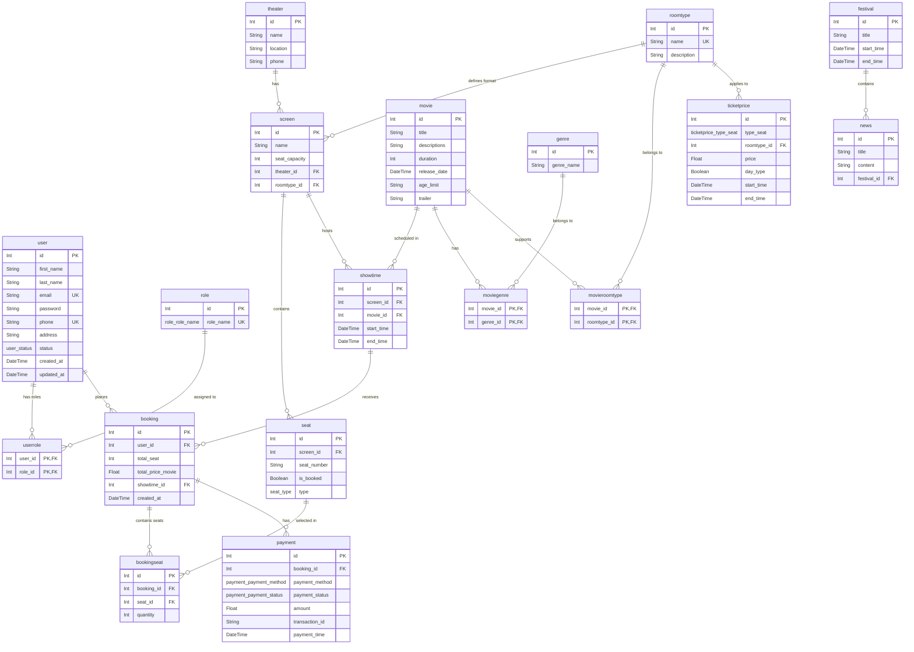

# BÁO CÁO DỰ ÁN: HỆ THỐNG ĐẶT VÉ XEM PHIM TRỰC TUYẾN (MTBA)

Báo cáo này tài liệu hóa chi tiết về mục tiêu, phạm vi, thiết kế hệ thống, phân tích dữ liệu và quy trình quản lý dự án Movie Ticket Booking App (MTBA).

---

## 📌 Nội dung 2: Mục tiêu & Phạm vi Dự án (Project Scope)

### 1. Mô tả ngắn gọn dự án
**Hệ thống Đặt vé xem phim trực tuyến (MTBA - Movie Ticket Booking App)** là một nền tảng trực tuyến toàn diện được thiết kế nhằm phục vụ nhu cầu đặt vé của khách hàng và tối ưu hóa quy trình quản lý rạp chiếu phim cho các quản trị viên và nhân viên.

*   **Hệ thống này làm gì?**
    *   **Đối với khách hàng**: Cho phép duyệt phim đang chiếu/sắp chiếu, xem thông tin chi tiết phim (trailer, diễn viên, thời lượng), xem lịch chiếu của từng rạp, chọn ghế trống trên sơ đồ trực quan và thực hiện thanh toán trực tuyến qua VietQR (tích hợp SePay) hoặc các cổng thanh toán. Sau khi đặt vé thành công, hệ thống tự động gửi email xác nhận kèm thông tin chi tiết vé.
    *   **Đối với nhân viên tại quầy (POS)**: Hỗ trợ đặt vé trực tiếp cho khách hàng và đồng bộ hiển thị màn hình phụ POS2 (màn hình hiển thị tĩnh một chiều dành riêng cho khách hàng đối chiếu thông tin đặt vé mà không gây lỗi lặp điều hướng vô hạn).
    *   **Đối với quản trị viên (Admin)**: Cung cấp trang quản lý (Dashboard) để theo dõi doanh thu, số lượng vé bán ra, quản lý thông tin phim, rạp chiếu, phòng chiếu (`screen`), lịch chiếu (`showtime`), sơ đồ ghế (`seat`), giá vé (`ticketprice`), tin tức (`news`), lễ hội phim (`festival`) và quản lý tài khoản người dùng (`user`).
*   **Giải quyết vấn đề gì?**
    *   **Thời gian chờ đợi**: Khách hàng không cần xếp hàng mua vé trực tiếp tại quầy, giảm tải cho nhân viên rạp vào các khung giờ cao điểm.
    *   **Lỗi trùng lịch chiếu (Overlap Showtime)**: Hệ thống giải quyết triệt để bài toán chồng chéo lịch chiếu tại cùng một phòng chiếu thông qua thuật toán tự động kiểm tra khoảng thời gian (`start_time`, `end_time`) khi Admin tạo hoặc sửa lịch chiếu.
    *   **Hiện tượng đầu cơ vé**: Giới hạn tối đa **8 ghế** cho mỗi giao dịch thanh toán của khách hàng để đảm bảo tính công bằng.
    *   **Rủi ro thanh toán**: Sử dụng cơ chế Webhook kết hợp Active Polling từ cổng SePay giúp đối soát chính xác mã giao dịch chuyển khoản VietQR, tự động kiểm tra ghế trống trước khi hoàn tất để tránh trường hợp mua trùng ghế khi thanh toán bị trễ (quá hạn giữ ghế).
    *   **Bảo mật dữ liệu**: Sử dụng thuật toán băm mật khẩu `bcryptjs` kết hợp cơ chế thêm chuỗi bí mật `PASSWORD_PEPPER` cấu hình tập trung từ biến môi trường giúp ngăn chặn tấn công dò mật khẩu.

### 2. Phạm vi dự án & Vai trò thành viên
Đây là một **Dự án Nhóm (Group Project)** được phát triển theo mô hình Agile/Scrum với 4 thành viên. Dưới đây là phân chia vai trò và nhiệm vụ chi tiết:

| Thành viên | Vai trò chính | Nhiệm vụ chi tiết |
| :--- | :--- | :--- |
| **Thành viên A** | Scrum Master & Backend Developer | - Điều phối các buổi họp của nhóm (Daily Standup, Sprint Planning).<br>- Thiết kế kiến trúc Backend bằng NestJS.<br>- Triển khai các API nghiệp vụ chính: Đặt vé (`booking`), quản lý thanh toán (`payment`), tích hợp cổng VietQR (SePay Webhook & Active Polling).<br>- Viết hệ thống quản lý lỗi tập trung và bảo mật mật khẩu (Bcrypt + Pepper). |
| **Thành viên B** | Frontend Developer | - Thiết kế giao diện UI/UX trực quan bằng Next.js (App Router, React 19) và Tailwind CSS v4.<br>- Triển khai luồng đặt vé trực tuyến cho Khách hàng và giao diện POS cho Nhân viên.<br>- Xây dựng cơ chế đồng bộ một chiều màn hình phụ POS2, loại bỏ vòng lặp điều hướng vô hạn (endless routing ping-pong).<br>- Tích hợp các API từ Backend, xử lý hiển thị thông báo lỗi chi tiết từ máy chủ. |
| **Thành viên C** | Database Designer & Backend Developer | - Thiết kế cơ sở dữ liệu và triển khai thông qua Prisma ORM.<br>- Xây dựng các API quản trị: Quản lý phim, rạp chiếu, phòng chiếu, lịch chiếu, giá vé.<br>- Triển khai logic kiểm tra trùng lặp lịch chiếu (`Showtimes Overlap Check`) và giới hạn số lượng ghế đặt tối đa.<br>- Cập nhật cấu trúc DB thông qua Prisma Migrations. |
| **Thành viên D** | Product Owner & Quality Assurance (QA) | - Quản lý Product Backlog, viết User Stories và nghiệm thu tính năng.<br>- Thiết kế các ca kiểm thử (Test Cases).<br>- Viết Unit Test cho cả Frontend và Backend (đặc biệt là các API Đăng ký/Đăng nhập, Đặt vé, cập nhật thông tin).<br>- Quản lý tiến độ trên bảng Trello/Jira của nhóm. |

---

## 📌 Nội dung 3: Thiết kế Hệ thống & Phân tích Dữ liệu (System Design & DB)

### 1. Biểu đồ Use Case
Dưới đây là sơ đồ phân cấp các chức năng của hệ thống MTBA tương ứng với từng tác nhân (Guest, Customer, Staff, Admin):

```mermaid
graph TD
    %% Actors
    Guest[Khách vãng lai]
    Customer[Khách hàng đã đăng nhập]
    Staff[Nhân viên quầy POS]
    Admin[Quản trị viên]

    %% Use Cases Guest
    subgraph UC_Guest [Nhóm Khách Vãng Lai]
        UC1(Đăng ký / Đăng nhập)
        UC2(Xem phim đang chiếu / sắp chiếu)
        UC3(Xem chi tiết phim & trailer)
        UC4(Tra cứu lịch chiếu & giá vé)
    end

    %% Use Cases Customer
    subgraph UC_Customer [Nhóm Khách Hàng]
        UC5(Quản lý thông tin cá nhân / Đổi mật khẩu)
        UC6(Đặt vé trực tuyến: Chọn lịch, chọn ghế)
        UC7(Thanh toán trực tuyến VietQR / VNPay)
        UC8(Nhận email thông báo xác nhận vé)
        UC9(Xem lịch sử giao dịch đặt vé)
    end

    %% Use Cases Staff
    subgraph UC_Staff [Nhóm Nhân Viên POS]
        UC10(Đặt vé trực tiếp tại quầy cho khách)
        UC11(Đồng bộ màn hình phụ POS2 hiển thị cho khách)
    end

    %% Use Cases Admin
    subgraph UC_Admin [Nhóm Quản Trị Viên]
        UC12(Thống kê doanh thu, vé bán, người dùng)
        UC13(Quản lý phim, rạp, phòng chiếu & ghế)
        UC14(Quản lý lịch chiếu - Kiểm tra trùng giờ)
        UC15(Quản lý người dùng, phân quyền & khóa tài khoản)
        UC16(Quản lý giá vé, tin tức & sự kiện khuyến mãi)
    end

    Guest --> UC1
    Guest --> UC2
    Guest --> UC3
    Guest --> UC4

    Customer --> UC5
    Customer --> UC6
    Customer --> UC7
    Customer --> UC8
    Customer --> UC9

    Staff --> UC10
    Staff --> UC11

    Admin --> UC12
    Admin --> UC13
    Admin --> UC14
    Admin --> UC15
    Admin --> UC16
```



### 2. Mô hình Thực thể Kết hợp (ERD)
Sơ đồ ERD biểu diễn mối quan hệ giữa các bảng cơ sở dữ liệu trọng tâm được cấu hình tại [schema.prisma](file:///c:/Users/Simsimi/OneDrive/M%C3%A1y%20t%C3%ADnh/MTBA/code/backend/prisma/schema.prisma):



### 3. Sơ đồ Kiến trúc (Architecture Diagram)
Dự án được xây dựng theo mô hình kiến trúc 3 lớp (3-Tier Architecture) giúp chia tách rõ ràng các tầng giao diện, logic nghiệp vụ và lưu trữ:

```mermaid
graph TB
    subgraph Client [Tầng Giao Diện - Presentation Layer]
        NextJS[Next.js 16 Client App Router]
        Tailwind[Tailwind CSS v4]
        POS2[Màn hình phụ POS2 - Passive Display]
    end

    subgraph Server [Tầng Xử Lý Logic - Business Logic Layer]
        NestJS[NestJS 11 Web Framework]
        Auth[Auth Service - JWT, bcrypt + pepper]
        Booking[Booking Service - Seat Limit Check, Showtime Overlap Check]
        Prisma[Prisma ORM Client]
    end

    subgraph Storage [Tầng Dữ Liệu - Database Layer]
        MySQL[(MySQL Database)]
    end

    subgraph External [Hệ Thống Bên Ngoài - External Services]
        SePay[Cổng VietQR - SePay Webhook / Active Polling]
        Mailer[Mail Service - SMTP / SendGrid]
    end

    %% Connections
    NextJS <-->|REST APIs / JSON| NextJS
    POS2 <--|WebSockets / HTTP Polling| NextJS
    NestJS <-->|Prisma Queries| MySQL
    NestJS <-->|Webhook callback / REST API| SePay
    NestJS -->|Sends Email Notifications| Mailer
```

### 4. Công nghệ sử dụng
*   **Tầng Giao Diện (Frontend)**:
    *   **Next.js 16+ (App Router)**: Cung cấp tính năng Server Component tối ưu SEO và Client Component hỗ trợ các tương tác động (chọn ghế, thanh toán).
    *   **React 19**: Tận dụng các hook quản lý trạng thái mới.
    *   **Tailwind CSS v4**: Xây dựng hệ thống styling đồng bộ, giao diện hiện đại, responsive hoàn hảo trên mọi thiết bị.
*   **Tầng Xử Lý Logic (Backend)**:
    *   **NestJS 11+**: Khung làm việc Node.js mạnh mẽ, quản lý code theo các Module tách biệt (Controller xử lý DTO validation, Service xử lý Database).
    *   **Prisma Client**: Thư viện ORM hiện đại hỗ trợ tự động sinh các kiểu dữ liệu an toàn (Type-safe queries) kết nối MySQL.
    *   **TypeScript**: Đảm bảo tính nhất quán của kiểu dữ liệu toàn hệ thống.
*   **Cơ sở dữ liệu**:
    *   **MySQL 8.x**: Hệ quản trị cơ sở dữ liệu quan hệ mạnh mẽ, đảm bảo tính toàn vẹn dữ liệu (ACID).
*   **Bảo mật & Tích hợp**:
    *   **JWT (JSON Web Token)**: Xác thực không trạng thái (stateless) giữa Client và Server.
    *   **Bcryptjs & Pepper**: Mã hóa mật khẩu an toàn mức độ cao.
    *   **SePay VietQR API**: Hỗ trợ thanh toán nhanh bằng quét mã QR với cơ chế đối soát tự động qua Webhook bảo mật bằng `SEPAY_API_TOKEN`.

---

## 📌 Nội dung 4: Quản lý Dự án với Agile/Scrum (Project Management)

### 1. Product Backlog & User Stories
Dưới đây là danh sách các tính năng cốt lõi được định nghĩa dưới dạng các User Story phục vụ quá trình phát triển sản phẩm:

| ID | Vai trò (Actor) | Mong muốn (User Story) | Lý do (Benefit) | Độ ưu tiên |
| :--- | :--- | :--- | :--- | :--- |
| **US01** | Khách vãng lai | Đăng ký tài khoản bằng email/số điện thoại | Để bắt đầu sử dụng các dịch vụ đặt vé của hệ thống. | High |
| **US02** | Khách hàng | Xem danh sách phim đang chiếu và sắp chiếu | Để cập nhật và tìm kiếm phim phù hợp với sở thích. | High |
| **US03** | Khách hàng | Chọn lịch chiếu và ghế trống trên sơ đồ phòng | Để giữ chỗ ngồi mong muốn trong phòng chiếu. | High |
| **US04** | Khách hàng | Đặt vé tối đa 8 ghế cho mỗi giao dịch | Để tránh tình trạng đầu cơ vé hoặc lỗi hệ thống do đặt quá nhiều. | Medium |
| **US05** | Khách hàng | Thanh toán vé qua mã VietQR (SePay) | Để giao dịch nhanh chóng và tiện lợi mà không cần nhập số thẻ. | High |
| **US06** | Khách hàng | Nhận email hóa đơn sau khi đặt vé thành công | Để xác nhận thông tin vé và dùng làm thẻ vào phòng chiếu. | Medium |
| **US07** | Nhân viên | Nhập đơn đặt vé trực tiếp tại quầy POS | Để phục vụ những khách hàng mua vé trực tiếp tại rạp. | High |
| **US08** | Nhân viên | Đồng bộ thông tin đặt vé lên màn hình phụ POS2 | Để khách hàng đối chiếu thông tin ghế và tổng số tiền thanh toán. | Medium |
| **US09** | Admin | Xem các chỉ số thống kê doanh thu và lượng vé bán | Để đánh giá hiệu quả kinh doanh của các bộ phim và các rạp. | High |
| **US10** | Admin | Tạo và quản lý suất chiếu (`showtime`) | Để vận hành lịch chiếu phim hàng ngày mà không lo bị trùng giờ chiếu. | High |
| **US11** | Admin | Quản lý danh mục phim, phòng chiếu và giá vé | Để cập nhật các thông tin dịch vụ của rạp phim linh hoạt. | High |

### 2. Quá trình chạy Sprint
Dự án được triển khai qua **4 Sprints** chính, mỗi Sprint kéo dài trong vòng 2 tuần:

#### 🏃‍♂️ Sprint 1: Khởi động dự án, thiết kế DB & Cấu trúc mã nguồn
*   **Thời gian**: Tuần 1 - Tuần 2
*   **Sprint Goal**: Thiết lập hạ tầng monorepo, hoàn thành thiết kế Schema cơ sở dữ liệu và triển khai API xác thực (Đăng ký, Đăng nhập, Phân quyền).
*   **User Stories thực hiện**: US01.
*   **Kết quả đạt được**:
    *   Khởi tạo cấu trúc monorepo với npm workspaces cho `code/frontend` và `code/backend`.
    *   Đồng bộ DB qua [schema.prisma](file:///c:/Users/Simsimi/OneDrive/M%C3%A1y%20t%C3%ADnh/MTBA/code/backend/prisma/schema.prisma) thành công lên MySQL.
    *   Hoàn thành `AuthModule` sử dụng JWT, `bcryptjs` kết hợp `PASSWORD_PEPPER` để bảo vệ tài khoản.

#### 🏃‍♂️ Sprint 2: Xây dựng các chức năng cốt lõi (Phim, Lịch chiếu, Tìm kiếm)
*   **Thời gian**: Tuần 3 - Tuần 4
*   **Sprint Goal**: Xây dựng thành công các API quản lý phim, phòng chiếu, suất chiếu (có kiểm tra overlap) và hoàn thiện giao diện xem danh sách phim của khách hàng.
*   **User Stories thực hiện**: US02, US10, US11.
*   **Kết quả đạt được**:
    *   Xây dựng thuật toán kiểm tra overlap suất chiếu trong `ShowtimeService` (Nếu `new_start_time < existing_end_time` và `new_end_time > existing_start_time` tại cùng một `screen_id` thì chặn và báo lỗi).
    *   Hoàn thiện trang chủ và trang chi tiết phim trên giao diện Client.
    *   Hỗ trợ tìm kiếm, lọc phim theo thể loại, ngày chiếu.

#### 🏃‍♂️ Sprint 3: Tích hợp Đặt vé, Thanh toán SePay & Đồng bộ POS
*   **Thời gian**: Tuần 5 - Tuần 6
*   **Sprint Goal**: Triển khai nghiệp vụ đặt ghế trực quan (giới hạn 8 vé), tích hợp cổng thanh toán tự động SePay VietQR và xây dựng cơ chế đồng bộ màn hình phụ POS2.
*   **User Stories thực hiện**: US03, US04, US05, US06, US07, US08.
*   **Kết quả đạt được**:
    *   Xây dựng API đặt vé kiểm tra giới hạn 8 vé (`BadRequestException` với thông báo `SEAT_LIMIT_EXCEEDED`).
    *   Tích hợp thành công Webhook `/payments-webhook` nhận dữ liệu giao dịch từ SePay, tự động kiểm tra xem ghế đã bị mua bởi đơn đặt vé thành công khác chưa trước khi chuyển đổi trạng thái `COMPLETED` cho đơn hàng quá hạn thanh toán.
    *   Hoàn thiện cơ chế đồng bộ một chiều từ Staff lên server để hiển thị tại Client POS2 mà không làm xảy ra hiện tượng endless routing loop.
    *   Cấu hình gửi email xác nhận đặt vé qua SMTP.

#### 🏃‍♂️ Sprint 4: Dashboard Quản trị, Viết Unit Test & Bàn giao hệ thống
*   **Thời gian**: Tuần 7 - Tuần 8
*   **Sprint Goal**: Hoàn thiện toàn bộ trang quản trị của Admin, đạt độ bao phủ Unit Test cho các nghiệp vụ chính, tối ưu hóa bảo mật và bàn giao sản phẩm.
*   **User Stories thực hiện**: US09.
*   **Kết quả đạt được**:
    *   Hoàn thiện giao diện Admin Dashboard với các biểu đồ thống kê doanh thu theo ngày/tháng/năm, thống kê số lượng vé bán ra theo từng rạp và từng phim.
    *   Hoàn thành bộ Unit Test bằng Jest cho các chức năng Đăng ký, Đăng nhập, Cập nhật thông tin và nghiệp vụ Đặt vé.
    *   Chuẩn hóa tất cả API cập nhật thành phương thức `@Put(':id')` để đồng nhất cấu trúc thiết kế.
    *   Loại bỏ toàn bộ mã cứng (magic strings) khỏi Backend bằng cách quy hoạch tập trung các thông báo lỗi vào [error-messages.constant.ts](file:///c:/Users/Simsimi/OneDrive/M%C3%A1y%20t%C3%ADnh/MTBA/code/backend/src/common/constants/error-messages.constant.ts).
