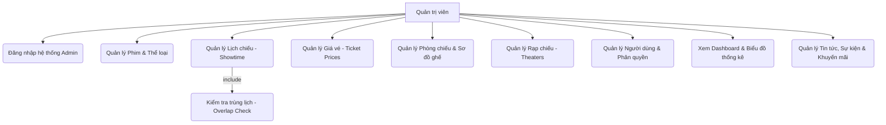
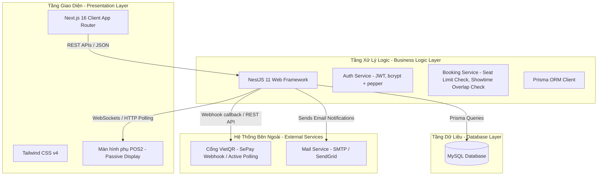
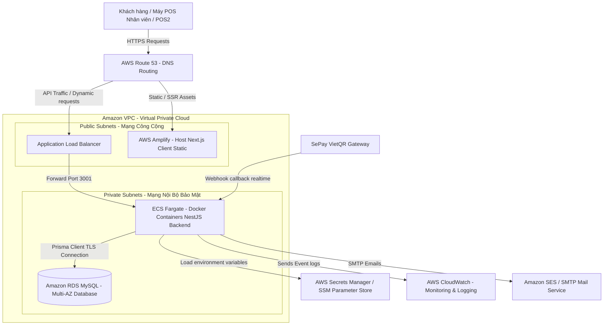
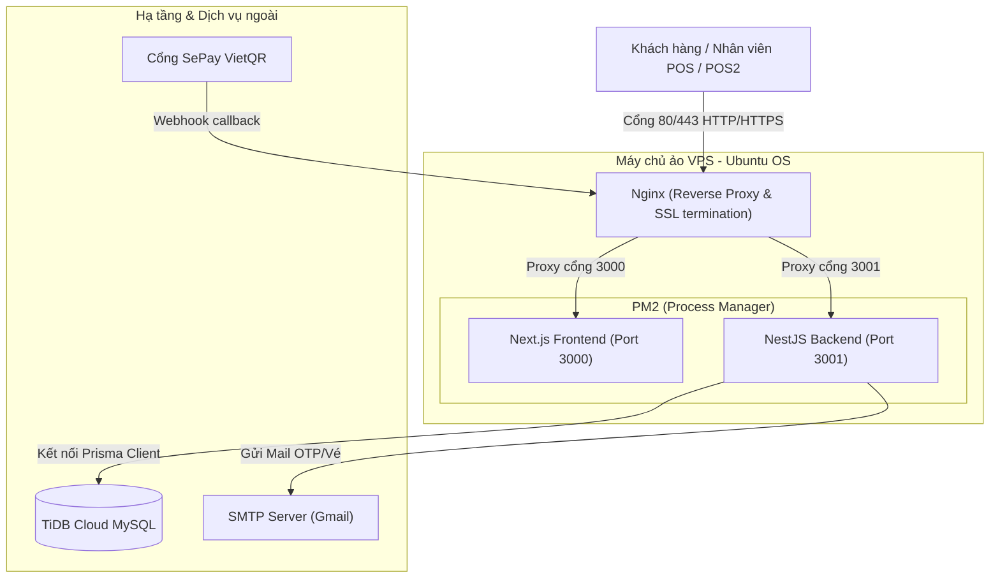

# BÁO CÁO DỰ ÁN: HỆ THỐNG ĐẶT VÉ XEM PHIM TRỰC TUYẾN (MTBA)

Báo cáo này tài liệu hóa chi tiết về mục tiêu, phạm vi, thiết kế hệ thống, phân tích dữ liệu và quy trình quản lý dự án Movie Ticket Booking App (MTBA).

---

## 📌 Nội dung 2: Mục tiêu & Phạm vi Dự án (Project Scope)

### 1. Mô tả ngắn gọn dự án
**Hệ thống Đặt vé xem phim trực tuyến (MTBA - Movie Ticket Booking App)** là một nền tảng trực tuyến toàn diện được thiết kế nhằm phục vụ nhu cầu đặt vé của khách hàng và tối ưu hóa quy trình quản lý rạp chiếu phim cho các quản trị viên và nhân viên.

*   **Hệ thống này làm gì?**
    *   **Đối với khách hàng**: Cho phép duyệt phim đang chiếu/sắp chiếu, xem thông tin chi tiết phim (trailer, diễn viên, thời lượng), xem lịch chiếu của từng rạp, chọn ghế trống trên sơ đồ trực quan và thực hiện thanh toán trực tuyến qua VietQR (tích hợp SePay) hoặc các cổng thanh toán. Sau khi đặt vé thành công, hệ thống tự động gửi email xác nhận kèm thông tin chi tiết vé.
    *   **Đối với nhân viên tại quầy (POS)**: Hỗ trợ đặt vé trực tiếp cho khách hàng và đồng bộ hiển thị màn hình phụ POS2 (màn hình hiển thị tĩnh một chiều dành riêng cho khách hàng đối chiếu thông tin đặt vé mà không gây lỗi lặp điều hướng vô hạn).
    *   **Đối với quản trị viên (Admin)**: Cung cấp trang quản lý (Dashboard) để theo dõi doanh thu, số lượng vé bán ra, quản lý thông tin phim, rạp chiếu, phòng chiếu (`screen`), lịch chiếu (`showtime`), sơ đồ ghế (`seat`), giá vé (`ticketprice`), tin tức (`news`), lễ hội phim (`festival`) và quản lý tài khoản người dùng (`user`).
*   **Giải quyết vấn đề gì? (Customer Pain Points & Needs)**
    *   *Xếp hàng chờ đợi mua vé truyền thống*: Khách hàng mất quá nhiều thời gian xếp hàng tại quầy vào các khung giờ cao điểm hoặc dịp lễ. Hệ thống đáp ứng nhu cầu đặt vé trực tuyến 24/7 từ xa của khách hàng.
    *   *Mơ hồ về vị trí ghế ngồi*: Khi mua vé trực tiếp, khách hàng khó chọn được vị trí ghế ưng ý do không có sơ đồ trực quan. Hệ thống cung cấp sơ đồ ghế trực quan thời gian thực để đáp ứng nhu cầu tự chọn vị trí tối ưu.
    *   *Rủi ro chuyển khoản sai lệch hoặc xác nhận thủ công chậm*: Chuyển khoản truyền thống mất thời gian đối soát thủ công và dễ sai thông tin. Khách hàng cần một cơ chế thanh toán quét mã QR tự động hóa xác nhận tức thì.
    *   *Bất tiện khi mua vé trực tiếp tại quầy*: Khách mua vé tại quầy không được đối chiếu thông tin ghế và hóa đơn, dễ xảy ra sai sót từ nhân viên. Khách hàng cần một màn hình phụ hiển thị trực quan thông tin đặt vé tại quầy.
    *   *Thiếu thông tin ưu đãi và sự kiện*: Khách hàng bỏ lỡ các chương trình khuyến mãi hoặc tin tức phim do thông tin phân tán. Họ cần một giao diện tổng hợp tin tức điện ảnh và sự kiện ưu đãi trực quan.

*   **Phạm vi dự án giải quyết các Pain Points cụ thể (Implementation Scope)**
    *   *Hệ thống Đặt vé & Chọn ghế trực quan (Frontend/Backend)*: Xây dựng sơ đồ ghế ngồi động theo thời gian thực giúp khách hàng tự do lựa chọn vị trí và đặt vé trực tuyến nhanh chóng trong vòng 1-2 phút, giải quyết triệt để nỗi đau xếp hàng chờ đợi.
    *   *Tự động hóa thanh toán VietQR (SePay)*: Tích hợp Webhook kết hợp Active Polling đối soát tự động giao dịch chuyển khoản. Hệ thống tự động kiểm tra trạng thái ghế trống trước khi hoàn tất giao dịch để tránh trường hợp trùng ghế khi thanh toán trễ, đồng thời gửi email hóa đơn tự động qua SMTP giúp nâng cao độ tin cậy.
    *   *Đồng bộ màn hình phụ POS2 một chiều*: Triển khai màn hình phụ POS2 hiển thị thông tin đặt vé trực tiếp cho khách hàng đối chiếu tại quầy, loại bỏ hoàn toàn rủi ro sai sót thông tin và không gây ra hiện tượng lặp điều hướng vô hạn (endless routing loop).
    *   *Thuật toán kiểm tra trùng lịch chiếu (Showtimes Overlap Check)*: Xử lý ở tầng nghiệp vụ Backend NestJS để ngăn chặn Admin tạo hoặc sửa suất chiếu bị chồng chéo thời gian tại cùng một phòng chiếu, đảm bảo lịch vận hành rạp luôn thông suốt.
    *   *Trang Admin Dashboard & Slideshow Tin tức/Khuyến mãi*: Quản trị viên dễ dàng CRUD tin tức bài viết, khuyến mãi và liên hoan phim để tự động cập nhật, xoay chuyển slideshow mỗi 10 giây trên trang chủ khách hàng giúp tăng trải nghiệm tiếp cận thông tin.

### 2. Phạm vi dự án & Vai trò thành viên
Đây là một **Dự án Nhóm (Group Project)** được phát triển theo mô hình Agile/Scrum với 4 thành viên. Dưới đây là phân chia vai trò và nhiệm vụ chi tiết:

| Thành viên | Vai trò chính | Nhiệm vụ chi tiết |
| :--- | :--- | :--- |
| **Thành viên A** | Scrum Master & Backend Developer | - Điều phối các buổi họp của nhóm (Daily Standup, Sprint Planning). - Thiết kế kiến trúc Backend bằng NestJS. - Triển khai các API nghiệp vụ chính: Đặt vé (`booking`), quản lý thanh toán (`payment`), tích hợp cổng VietQR (SePay Webhook & Active Polling). - Viết hệ thống quản lý lỗi tập trung và bảo mật mật khẩu (Bcrypt + Pepper). |
| **Thành viên B** | Frontend Developer | - Thiết kế giao diện UI/UX trực quan bằng Next.js (App Router, React 19) và Tailwind CSS v4. - Triển khai luồng đặt vé trực tuyến cho Khách hàng và giao diện POS cho Nhân viên. - Xây dựng cơ chế đồng bộ một chiều màn hình phụ POS2, loại bỏ vòng lặp điều hướng vô hạn (endless routing ping-pong). - Tích hợp các API từ Backend, xử lý hiển thị thông báo lỗi chi tiết từ máy chủ. |
| **Thành viên C** | Database Designer & Backend Developer | - Thiết kế cơ sở dữ liệu và triển khai thông qua Prisma ORM. - Xây dựng các API quản trị: Quản lý phim, rạp chiếu, phòng chiếu, lịch chiếu, giá vé. - Triển khai logic kiểm tra trùng lặp lịch chiếu (`Showtimes Overlap Check`) và giới hạn số lượng ghế đặt tối đa. - Cập nhật cấu trúc DB thông qua Prisma Migrations. |
| **Thành viên D** | Product Owner & Quality Assurance (QA) | - Quản lý Product Backlog, viết User Stories và nghiệm thu tính năng. - Thiết kế các ca kiểm thử (Test Cases). - Viết Unit Test cho cả Frontend và Backend (đặc biệt là các API Đăng ký/Đăng nhập, Đặt vé, cập nhật thông tin). - Quản lý tiến độ trên bảng Trello/Jira của nhóm. |

---

## 📌 Nội dung 3: Thiết kế Hệ thống & Phân tích Dữ liệu (System Design & DB)

### 1. Biểu đồ Use Case
Dưới đây là sơ đồ phân cấp các chức năng của hệ thống MTBA tương ứng với từng tác nhân (Guest, Customer, Staff, Admin):

```mermaid
graph TD
    %% Actors
    Guest[Khách vãng lai]
    Customer[Khách hàng đã đăng nhập]
    Staff[Nhân viên quầy POS]
    Admin[Quản trị viên]

    %% Use Cases Guest
    subgraph UC_Guest [Nhóm Khách Vãng Lai]
        UC1(Đăng ký / Đăng nhập)
        UC2(Xem phim đang chiếu / sắp chiếu)
        UC3(Xem chi tiết phim & trailer)
        UC4(Tra cứu lịch chiếu & giá vé)
    end

    %% Use Cases Customer
    subgraph UC_Customer [Nhóm Khách Hàng]
        UC5(Quản lý thông tin cá nhân / Đổi mật khẩu)
        UC6(Đặt vé trực tuyến: Chọn lịch, chọn ghế)
        UC7(Thanh toán trực tuyến VietQR / VNPay)
        UC8(Nhận email thông báo xác nhận vé)
        UC9(Xem lịch sử giao dịch đặt vé)
    end

    %% Use Cases Staff
    subgraph UC_Staff [Nhóm Nhân Viên POS]
        UC10(Đặt vé trực tiếp tại quầy cho khách)
        UC11(Đồng bộ màn hình phụ POS2 hiển thị cho khách)
    end

    %% Use Cases Admin
    subgraph UC_Admin [Nhóm Quản Trị Viên]
        UC12(Thống kê doanh thu, vé bán, người dùng)
        UC13(Quản lý phim, rạp, phòng chiếu & ghế)
        UC14(Quản lý lịch chiếu - Kiểm tra trùng giờ)
        UC15(Quản lý người dùng, phân quyền & khóa tài khoản)
        UC16(Quản lý giá vé, tin tức & sự kiện khuyến mãi)
    end

    Guest --> UC1
    Guest --> UC2
    Guest --> UC3
    Guest --> UC4

    Customer --> UC5
    Customer --> UC6
    Customer --> UC7
    Customer --> UC8
    Customer --> UC9

    Staff --> UC10
    Staff --> UC11

    Admin --> UC12
    Admin --> UC13
    Admin --> UC14
    Admin --> UC15
    Admin --> UC16
```

### 1.1. Sơ đồ Use Case chi tiết vai trò Admin (Quản trị viên)
Dưới đây là sơ đồ đặc tả các phân hệ quản lý và nghiệp vụ kiểm tra chặt chẽ dành riêng cho Admin:

### 2. Mô hình Thực thể Kết hợp (ERD)
Sơ đồ ERD biểu diễn mối quan hệ giữa các bảng cơ sở dữ liệu trọng tâm được cấu hình tại [schema.prisma](file:///c:/Users/Simsimi/OneDrive/M%C3%A1y%20t%C3%ADnh/MTBA/code/backend/prisma/schema.prisma):

### 3. Sơ đồ Kiến trúc (Architecture Diagram)
Dự án được xây dựng theo mô hình kiến trúc 3 lớp (3-Tier Architecture) giúp chia tách rõ ràng các tầng giao diện, logic nghiệp vụ và lưu trữ:

#### Phân tích chi tiết Sơ đồ Kiến trúc:
*   **Tầng Giao Diện (Presentation Layer)**:
    *   *Next.js 16 Client App Router*: Đóng vai trò là điểm tương tác trực tiếp với khách hàng. Sử dụng React Server Components (RSC) cho các trang tĩnh cần tối ưu hóa tốc độ tải trang và SEO (như danh sách phim, tin tức). Sử dụng Client Components cho các thành phần cần quản lý trạng thái phức tạp (sơ đồ ghế ngồi động, thanh toán quét mã QR).
    *   *Màn hình phụ POS2 (Passive Display)*: Được thiết kế là một client tĩnh đặc biệt kết nối một chiều nhận dữ liệu trạng thái thông tin đơn vé từ nhân viên quầy POS thông qua giao thức WebSockets hoặc HTTP Polling liên tục, giúp loại bỏ hoàn toàn khả năng xảy ra lỗi lặp điều hướng vô hạn (endless routing loop).
*   **Tầng Xử Lý Logic (Business Logic Layer)**:
    *   *NestJS 11 Web Framework*: Đóng vai trò là hạt nhân điều phối toàn bộ nghiệp vụ (Backend API). Nhận các REST HTTP request từ Client, thực hiện kiểm tra dữ liệu đầu vào bằng validation DTO, bảo vệ các API riêng tư bằng JWT Auth Guard kết hợp phân quyền Roles Guard.
    *   *Nghiệp vụ cốt lõi*: Xử lý kiểm tra chống trùng lịch chiếu phim (`Showtimes Overlap Check`), chặn đầu cơ (giới hạn tối đa 8 ghế/đơn đặt vé), mã hóa mật khẩu thông qua Bcryptjs kết hợp chuỗi Pepper tĩnh lấy từ biến môi trường.
    *   *Prisma ORM Client*: Đóng vai trò là cầu nối truy vấn dữ liệu an toàn kiểu dữ liệu (Type-safe queries) giữa NestJS và MySQL.
*   **Tầng Dữ Liệu (Database Layer)**:
    *   *MySQL 8.x Database*: Lưu trữ toàn bộ dữ liệu quan hệ của hệ thống. Nhờ cơ chế ACID, MySQL bảo đảm độ nhất quán dữ liệu ở mức cao nhất, ngăn chặn tình trạng hai khách hàng đặt trùng một ghế trong cùng một thời điểm.
*   **Tích Hợp Hệ Thống Bên Ngoài (External Services)**:
    *   *SePay API (VietQR)*: Tích hợp Webhook kết hợp Active Polling để nhận và đối soát tự động giao dịch chuyển khoản VietQR dựa theo mã đơn vé (`bookingId`) và số tiền (`amount`), tự động hoàn tất vé quá hạn nếu ghế chưa bị trùng.
    *   *SMTP Mail Service*: Gửi email tự động xác nhận thông tin vé kèm mã QR check-in ngay sau khi giao dịch thành công.

---

### 3.1. Sơ đồ Triển khai hệ thống trên AWS (AWS Deployment Diagram)
Để vận hành hệ thống MTBA trong môi trường Production thực tế với độ sẵn sàng cao (High Availability), khả năng tự động co giãn (Auto Scaling) và bảo mật nghiêm ngặt, hệ thống được đề xuất triển khai trên nền tảng Amazon Web Services (AWS) theo sơ đồ sau:

#### Phân tích chi tiết mô hình Deploy trên AWS:
1.  **AWS Route 53 & AWS Amplify**:
    *   *AWS Route 53*: Đóng vai trò là dịch vụ quản lý DNS, chịu trách nhiệm định tuyến người dùng đến các endpoint phù hợp (Amplify cho giao diện tĩnh và Application Load Balancer cho các request API).
    *   *AWS Amplify (Frontend Next.js)*: Tự động biên dịch và phân phối mã nguồn Next.js. Amplify tích hợp sẵn CDN toàn cầu giúp phân phối các tệp tin tĩnh (JS, CSS, hình ảnh) đến khách hàng với độ trễ cực thấp.
2.  **Amazon VPC & Private Subnets (Bảo mật mạng)**:
    *   Toàn bộ Backend NestJS và Database MySQL được cô lập hoàn toàn bên trong các **Private Subnets** (Mạng nội bộ) của **Amazon VPC** (Virtual Private Cloud). Các thành phần này không có IP công cộng và không thể bị truy cập trực tiếp từ Internet, giúp triệt tiêu các cuộc tấn công mạng trực tiếp.
3.  **Application Load Balancer (ALB)**:
    *   Đứng ở **Public Subnet** để tiếp nhận các REST API requests từ Next.js Client. ALB chịu trách nhiệm giải mã SSL/TLS (HTTPS) và phân phối các request API vào các container NestJS chạy dưới mạng nội bộ, đồng thời thực hiện cơ chế lọc traffic cơ bản.
4.  **Amazon ECS Fargate (Tầng Backend container)**:
    *   Backend NestJS được đóng gói thành các Docker Image và chạy trong **Amazon ECS (Elastic Container Service)** với chế độ chạy **AWS Fargate** (Serverless container). 
    *   Cấu hình **Auto Scaling** dựa trên mức độ sử dụng CPU/RAM để tự động tăng hoặc giảm số lượng task (container) đang chạy, đảm bảo hệ thống không bị sập khi lượng khách đặt vé tăng đột biến (ví dụ: giờ cao điểm ra mắt phim bom tấn).
5.  **Amazon RDS MySQL (Tầng lưu trữ)**:
    *   Sử dụng dịch vụ **Amazon RDS (Relational Database Service) MySQL**. 
    *   Cấu hình **Multi-AZ (Multiple Availability Zones)**: RDS tự động đồng bộ dữ liệu sang một vùng dự phòng độc lập vật lý khác. Nếu vùng chính gặp sự cố thiên tai hoặc mất điện, RDS tự động failover (chuyển đổi) sang vùng dự phòng trong vài giây để hệ thống hoạt động không bị gián đoạn.
6.  **AWS Secrets Manager & CloudWatch**:
    *   *AWS Secrets Manager*: Quản lý tập trung các thông tin nhạy cảm của hệ thống như mật khẩu DB (`DATABASE_URL`), JWT secret key, khóa bí mật băm mật khẩu `PASSWORD_PEPPER`, và mã token webhook của SePay `SEPAY_API_TOKEN`. ECS Fargate sẽ load động các cấu hình này vào biến môi trường khi khởi chạy thay vì lưu cứng trong source code.
    *   *AWS CloudWatch*: Giám sát tài nguyên phần cứng, thu thập logs thời gian thực từ các task ECS để hỗ trợ đội ngũ phát triển debug và bảo trì hệ thống.

---

### 3.2. Sơ đồ Triển khai thực tế trên VPS (Actual VPS Deployment Diagram)
Để vận hành hệ thống MTBA thử nghiệm thực tế với chi phí tối ưu và dễ dàng phát triển, hệ thống được triển khai trên máy chủ ảo VPS độc lập chạy hệ điều hành Ubuntu Server. Dưới đây là sơ đồ chi tiết kiến trúc triển khai thực tế của hệ thống:

#### Phân tích chi tiết mô hình Deploy trên VPS:
1. **Nginx (Web Server / Reverse Proxy & SSL)**:
    * **Reverse Proxy**: Nginx tiếp nhận các request từ ngoài mạng Internet trên cổng mặc định 80 (HTTP) và 443 (HTTPS) sau đó chuyển tiếp (forward) các request tương ứng vào các dịch vụ chạy nội bộ. Cụ thể, các request trang chính `/` sẽ chuyển vào Next.js (cổng 3000), và các request API `/api/` sẽ chuyển thẳng vào NestJS (cổng 3001) bằng cơ chế rewrite và proxy pass của Nginx (loại bỏ tiền tố `/api/` trước khi gửi đến NestJS).
    * **SSL Termination**: Nginx kết hợp với Certbot (Let's Encrypt) để cài đặt chứng chỉ SSL tự động, mã hóa toàn bộ dữ liệu truyền tải qua giao thức HTTPS bảo mật, đáp ứng yêu cầu truyền thông tin an toàn của các cổng thanh toán.
2. **PM2 (Node.js Process Manager)**:
    * **Duy trì dịch vụ (Daemon Mode)**: Giúp chạy ẩn ứng dụng Next.js và NestJS dưới nền hệ thống mà không cần giữ cửa sổ dòng lệnh terminal luôn mở.
    * **Khởi phục lỗi tự động (Auto-restart)**: Theo dõi trạng thái của các tiến trình. Nếu tiến trình bị crash do lỗi ngoại lệ chưa bắt được hoặc do rò rỉ bộ nhớ, PM2 tự động khởi động lại trong vòng vài mili-giây.
    * **Startup System**: Tích hợp với dịch vụ `systemd` của Linux để tự động khôi phục các tiến trình ngay sau khi hệ thống VPS khởi động lại hoặc mất nguồn điện đột ngột.
3. **Prisma ORM & Client**:
    * Đóng vai trò đồng bộ trực tiếp cấu trúc dữ liệu (`schema.prisma`) từ local lên VPS database thông qua lệnh `npx prisma db push`, giúp tự động đồng bộ hóa các bảng mà không cần quản lý các file migration thủ công phức tạp trong giai đoạn phát triển nhanh.
4. **TiDB Cloud (Database Service)**:
    * Cơ sở dữ liệu MySQL chạy trên nền đám mây của TiDB giúp VPS giảm thiểu tải CPU/RAM cho việc vận hành database nội bộ, đồng thời tận dụng hiệu năng cao của hạ tầng điện toán đám mây.

---

### 4. Công nghệ sử dụng

#### 💡 Nguyên tắc lựa chọn: Sử dụng Framework thay vì Thư viện tự do
Trong quá trình thiết kế hệ thống MTBA, đội ngũ phát triển quyết định sử dụng các **Framework hoàn chỉnh (Next.js, NestJS)** thay vì các **Thư viện riêng lẻ (React, Express)** hoặc viết mã nguồn Node.js thuần. Lý do cốt lõi bao gồm:
1.  **Inversion of Control (IoC - Đảo ngược điều khiển)**: Framework tự quản lý vòng đời của ứng dụng và điều hướng luồng chạy, bắt buộc lập trình viên viết code theo các quy chuẩn tốt nhất (Best Practices). Ngược lại, thư viện yêu cầu lập trình viên tự chắp vá các thư viện phụ (routing, state, build tools) dễ dẫn đến xung đột phiên bản và cấu trúc spaghetti.
2.  **Chuẩn hóa cấu trúc dự án (Convention over Configuration)**: Việc sử dụng framework giúp toàn bộ thành viên trong nhóm thống nhất tuyệt đối về cấu trúc thư mục, cách quản lý route, gọi API và xử lý middleware, giúp giảm thiểu thời gian setup ban đầu và tối ưu hóa hiệu quả bảo trì dài hạn.

---

*   **Tầng Giao Diện (Presentation Layer - Frontend)**:
    *   **Next.js 16+ (App Router)**: Nền tảng framework React hiện đại nhất.
        *   *Tại sao chọn Next.js (Framework) thay vì React thuần (Thư viện)*: React chỉ là thư viện hỗ trợ render giao diện người dùng. Nếu dùng React thuần, dự án sẽ phải tự cấu hình Router (React Router), tự thiết lập Webpack/Vite và chỉ có thể render hoàn toàn ở phía Client (CSR) - điều này gây ảnh hưởng nghiêm trọng tới SEO của các trang thông tin phim và tin tức. Next.js cung cấp giải pháp toàn diện bao gồm cơ chế **React Server Components (RSC)** để kết xuất tĩnh phía máy chủ giúp tăng tốc độ tải trang ban đầu (First Contentful Paint) và tối ưu SEO, đồng thời vẫn hỗ trợ **Client Components** cho các trang tương tác cao như sơ đồ chọn ghế và thanh toán.
        *   *Ứng dụng thực tiễn*: Triển khai luồng điều hướng mượt mà, tối ưu tài nguyên tải và quản lý router động (`/movies/[id]`, `/booking/[showtimeId]`).
    *   **React 19**: Phiên bản thư viện giao diện mới nhất.
        *   *Lý do lựa chọn*: Tối ưu hoá quá trình render lại (re-render) của các component, tích hợp tốt với cơ chế Server Actions và tối ưu state quản lý ghế ngồi trống thời gian thực.
    *   **Tailwind CSS v4**: Thư viện styling theo hướng Utility-first thế hệ mới.
        *   *Lý do lựa chọn*: Sử dụng hệ thống theme mới dựa trên CSS Variables giúp dễ dàng tùy biến giao diện tối/sáng (Dark Mode) và tạo hiệu ứng Glassmorphism hiện đại cho các khối thẻ. Hỗ trợ xây dựng giao diện hoàn toàn Responsive từ thiết bị di động của khách hàng cho đến màn hình tablet POS cỡ lớn của nhân viên và màn hình Passive Display POS2.

*   **Tầng Xử Lý Logic (Business Logic Layer - Backend)**:
    *   **NestJS 11+**: Framework Node.js được thiết kế theo kiến trúc hướng đối tượng (OOP).
        *   *Tại sao chọn NestJS (Framework) thay vì Node.js / Express thuần (Thư viện)*: 
            *   *Tránh hỗn loạn kiến trúc (Architecture Enforcement)*: Node.js/Express thuần là thư viện routing cực kỳ tự do và không áp đặt bất kỳ kiến trúc thư mục nào. Khi dự án phình to với hàng chục phân hệ quản lý phức tạp (Movie, Showtime, Screen, Booking, User, Payment, News...), Express sẽ trở nên vô cùng lộn xộn nếu không có cấu trúc quản lý chặt chẽ. NestJS giải quyết triệt để vấn đề này bằng cách ép buộc thiết kế theo các **Modules riêng biệt**, áp dụng nguyên lý SOLID và kiến trúc hướng đối tượng (OOP) vững chắc.
            *   *Tích hợp Dependency Injection (DI) & Providers*: Giúp tự động quản lý vòng đời của các Services, giảm thiểu sự phụ thuộc trực tiếp (tight coupling) và dễ dàng giả lập (mock) dữ liệu khi viết Unit Test.
            *   *Hệ sinh thái xử lý trung gian hoàn chỉnh*: Cung cấp sẵn hệ thống `Pipes` để tự động hóa validate dữ liệu đầu vào (DTO) ở Controller, `Guards` để phân quyền bảo mật cấp API, và `Exception Filters` giúp quản lý và định dạng lỗi tập trung thay vì lặp đi lặp lại code try-catch.
        *   *Ứng dụng thực tiễn*:
            *   *Controller*: Chịu trách nhiệm tiếp nhận request, kiểm tra định dạng dữ liệu đầu vào thông qua `ValidationPipe` cùng Class-Validator DTOs, ngăn chặn dữ liệu bẩn.
            *   *Service*: Nơi xử lý toàn bộ logic nghiệp vụ cốt lõi như kiểm tra chống trùng lịch chiếu (`Showtimes Overlap Check`), giới hạn đặt tối đa 8 ghế, tính toán tổng số tiền dựa theo khung giờ ngày/đêm và loại ghế.
            *   *Guards*: Sử dụng `JwtAuthGuard` kết hợp `RolesGuard` để phân quyền chặt chẽ các API mật thiết dành riêng cho Admin hoặc Staff dựa trên vai trò người dùng trong cơ sở dữ liệu.
    *   **Prisma Client**: Công cụ ORM (Object-Relational Mapping) thế hệ mới cho Node.js và TypeScript.
        *   *Lý do lựa chọn*: Tự động sinh kiểu dữ liệu (auto-generated types) dựa trên schema DB giúp ngăn ngừa lỗi truy vấn ngay từ thời điểm viết code (compile-time). Hỗ trợ các câu lệnh truy vấn phức tạp (Join, Aggregate) giữa các bảng `booking`, `showtime`, `screen`, `payment` một cách nhanh chóng và an toàn.
    *   **TypeScript**: Ngôn ngữ lập trình mã nguồn mở phát triển trên nền JavaScript.
        *   *Lý do lựa chọn*: Giúp định nghĩa kiểu dữ liệu chặt chẽ từ Frontend sang Backend, giảm thiểu tối đa các lỗi runtime phổ biến như `null` hoặc `undefined`.

*   **Cơ Sở Dữ Liệu (Database Layer)**:
    *   **MySQL 8.x**: Hệ quản trị cơ sở dữ liệu quan hệ (RDBMS) mạnh mẽ và phổ biến.
        *   *Lý do lựa chọn*: Đảm bảo tính toàn vẹn dữ liệu cực kỳ khắt khe theo tiêu chuẩn ACID (Atomicity, Consistency, Isolation, Durability) - điều tối quan trọng trong các nghiệp vụ giao dịch tài chính và đặt vé xem phim để tránh tình trạng hai khách hàng đặt trùng một ghế trong cùng một thời điểm.

*   **Bảo Mật & Tích Hợp Hệ Thống**: 
    *   **Mã Hóa Mật Khẩu (Bcryptjs & Pepper)**:
        *   *Cơ chế hoạt động*: Thay vì chỉ băm (hash) mật khẩu bằng Salt mặc định của Bcryptjs, hệ thống kết hợp thêm một chuỗi bí mật tĩnh gọi là **Pepper** (`PASSWORD_PEPPER`) được cấu hình duy nhất trong biến môi trường `.env` phía Server. Mật khẩu trước khi băm sẽ được ghép nối: `password + PEPPER`. Điều này ngăn chặn việc hacker có được database cũng không thể dùng bảng Rainbow Table để giải mã mật khẩu nếu không có chuỗi Pepper.
    *   **Xác Thực Không Trạng Thái (JWT - JSON Web Token)**:
        *   *Cơ chế hoạt động*: Sau khi người dùng đăng nhập thành công, Server ký và cấp một Access Token mã hóa chứa thông tin định danh và vai trò người dùng. Token này được lưu ở `localStorage` phía Frontend và đính kèm vào header `Authorization: Bearer <token>` trong các request gọi API tiếp theo để Server xác thực mà không cần truy vấn lại bảng session trong database.
    *   **Tích Hợp Cổng Thanh Toán VietQR (SePay API)**:
        *   *Cơ chế hoạt động*:
            *   *Active Polling*: Frontend định kỳ gọi API quét trạng thái giao dịch nhằm cập nhật nhanh cho người dùng.
            *   *Webhook Callback*: Cổng SePay tự động bắn một HTTP POST request chứa chi tiết giao dịch về endpoint `/payments-webhook` của Backend. Backend tiến hành xác thực webhook bằng token bảo mật `SEPAY_API_TOKEN` từ header. Sau khi khớp mã giao dịch (chứa `bookingId`) và số tiền, hệ thống cập nhật trạng thái đơn vé và giải phóng trạng thái giữ ghế trống.

## 📌 Nội dung 4: Quản lý Dự án với Agile/Scrum (Project Management)

### 1. Product Backlog & User Stories
Dưới đây là danh sách các tính năng cốt lõi được định nghĩa dưới dạng các User Story phục vụ quá trình phát triển sản phẩm:

| ID | Vai trò (Actor) | Mong muốn (User Story) | Lý do (Benefit) | Độ ưu tiên |
| :--- | :--- | :--- | :--- | :--- |
| **US01** | Khách vãng lai | Đăng ký tài khoản bằng email/số điện thoại | Để bắt đầu sử dụng các dịch vụ đặt vé của hệ thống. | High |
| **US02** | Khách hàng | Xem danh sách phim đang chiếu và sắp chiếu | Để cập nhật và tìm kiếm phim phù hợp với sở thích. | High |
| **US03** | Khách hàng | Chọn lịch chiếu và ghế trống trên sơ đồ phòng | Để giữ chỗ ngồi mong muốn trong phòng chiếu. | High |
| **US04** | Khách hàng | Đặt vé tối đa 8 ghế cho mỗi giao dịch | Để tránh tình trạng đầu cơ vé hoặc lỗi hệ thống do đặt quá nhiều. | Medium |
| **US05** | Khách hàng | Thanh toán vé qua mã VietQR (SePay) | Để giao dịch nhanh chóng và tiện lợi mà không cần nhập số thẻ. | High |
| **US06** | Khách hàng | Nhận email hóa đơn sau khi đặt vé thành công | Để xác nhận thông tin vé và dùng làm thẻ vào phòng chiếu. | Medium |
| **US07** | Nhân viên | Nhập đơn đặt vé trực tiếp tại quầy POS | Để phục vụ những khách hàng mua vé trực tiếp tại rạp. | High |
| **US08** | Nhân viên | Đồng bộ thông tin đặt vé lên màn hình phụ POS2 | Để khách hàng đối chiếu thông tin ghế và tổng số tiền thanh toán. | Medium |
| **US09** | Admin | Xem các chỉ số thống kê doanh thu và lượng vé bán | Để đánh giá hiệu quả kinh doanh của các bộ phim và các rạp. | High |
| **US10** | Admin | Tạo và quản lý suất chiếu (`showtime`) | Để vận hành lịch chiếu phim hàng ngày mà không lo bị trùng giờ chiếu. | High |
| **US11** | Admin | Quản lý danh mục phim, phòng chiếu và giá vé | Để cập nhật các thông tin dịch vụ của rạp phim linh hoạt. | High |

### 2. Quá trình chạy Sprint
Dự án được triển khai qua **4 Sprints** chính, mỗi Sprint kéo dài trong vòng 2 tuần:

#### 🏃‍♂️ Sprint 1: Khởi động dự án, thiết kế DB & Cấu trúc mã nguồn
*   **Thời gian**: Tuần 1 - Tuần 2
*   **Sprint Goal**: Thiết lập hạ tầng monorepo, hoàn thành thiết kế Schema cơ sở dữ liệu và triển khai API xác thực (Đăng ký, Đăng nhập, Phân quyền).
*   **User Stories thực hiện**: US01.
*   **Kết quả đạt được**:
    *   Khởi tạo cấu trúc monorepo với npm workspaces cho `code/frontend` và `code/backend`.
    *   Đồng bộ DB qua [schema.prisma](file:///c:/Users/Simsimi/OneDrive/M%C3%A1y%20t%C3%ADnh/MTBA/code/backend/prisma/schema.prisma) thành công lên MySQL.
    *   Hoàn thành `AuthModule` sử dụng JWT, `bcryptjs` kết hợp `PASSWORD_PEPPER` để bảo vệ tài khoản.

#### 🏃‍♂️ Sprint 2: Xây dựng các chức năng cốt lõi (Phim, Lịch chiếu, Tìm kiếm)
*   **Thời gian**: Tuần 3 - Tuần 4
*   **Sprint Goal**: Xây dựng thành công các API quản lý phim, phòng chiếu, suất chiếu (có kiểm tra overlap) và hoàn thiện giao diện xem danh sách phim của khách hàng.
*   **User Stories thực hiện**: US02, US10, US11.
*   **Kết quả đạt được**:
    *   Xây dựng thuật toán kiểm tra overlap suất chiếu trong `ShowtimeService` (Nếu `new_start_time < existing_end_time` và `new_end_time > existing_start_time` tại cùng một `screen_id` thì chặn và báo lỗi).
    *   Hoàn thiện trang chủ và trang chi tiết phim trên giao diện Client.
    *   Hỗ trợ tìm kiếm, lọc phim theo thể loại, ngày chiếu.

#### 🏃‍♂️ Sprint 3: Tích hợp Đặt vé, Thanh toán SePay & Đồng bộ POS
*   **Thời gian**: Tuần 5 - Tuần 6
*   **Sprint Goal**: Triển khai nghiệp vụ đặt ghế trực quan (giới hạn 8 vé), tích hợp cổng thanh toán tự động SePay VietQR và xây dựng cơ chế đồng bộ màn hình phụ POS2.
*   **User Stories thực hiện**: US03, US04, US05, US06, US07, US08.
*   **Kết quả đạt được**:
    *   Xây dựng API đặt vé kiểm tra giới hạn 8 vé (`BadRequestException` với thông báo `SEAT_LIMIT_EXCEEDED`).
    *   Tích hợp thành công Webhook `/payments-webhook` nhận dữ liệu giao dịch từ SePay, tự động kiểm tra xem ghế đã bị mua bởi đơn đặt vé thành công khác chưa trước khi chuyển đổi trạng thái `COMPLETED` cho đơn hàng quá hạn thanh toán.
    *   Hoàn thiện cơ chế đồng bộ một chiều từ Staff lên server để hiển thị tại Client POS2 mà không làm xảy ra hiện tượng endless routing loop.
    *   Cấu hình gửi email xác nhận đặt vé qua SMTP.

#### 🏃‍♂️ Sprint 4: Dashboard Quản trị, Viết Unit Test & Bàn giao hệ thống
*   **Thời gian**: Tuần 7 - Tuần 8
*   **Sprint Goal**: Hoàn thiện toàn bộ trang quản trị của Admin, đạt độ bao phủ Unit Test cho các nghiệp vụ chính, tối ưu hóa bảo mật và bàn giao sản phẩm.
*   **User Stories thực hiện**: US09.
*   **Kết quả đạt được**:
    *   Hoàn thiện giao diện Admin Dashboard với các biểu đồ thống kê doanh thu theo ngày/tháng/năm, thống kê số lượng vé bán ra theo từng rạp và từng phim.
    *   Hoàn thành bộ Unit Test bằng Jest cho các chức năng Đăng ký, Đăng nhập, Cập nhật thông tin và nghiệp vụ Đặt vé.
    *   Chuẩn hóa tất cả API cập nhật thành phương thức `@Put(':id')` để đồng nhất cấu trúc thiết kế.
    *   Loại bỏ toàn bộ mã cứng (magic strings) khỏi Backend bằng cách quy hoạch tập trung các thông báo lỗi vào [error-messages.constant.ts](file:///c:/Users/Simsimi/OneDrive/M%C3%A1y%20t%C3%ADnh/MTBA/code/backend/src/common/constants/error-messages.constant.ts).
