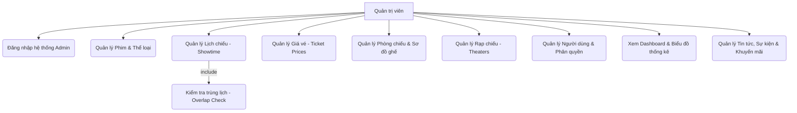

Dưới đây là sơ đồ đặc tả các phân hệ quản lý và nghiệp vụ kiểm tra chặt chẽ dành riêng cho Admin:

```mermaid
graph TD
    Admin[Quản trị viên] --> UC20(Đăng nhập hệ thống Admin)
    Admin --> UC21(Quản lý Phim & Thể loại)
    Admin --> UC22(Quản lý Lịch chiếu - Showtime)
    UC22 -->|include| UC23(Kiểm tra trùng lịch - Overlap Check)
    Admin --> UC23_1(Quản lý Giá vé - Ticket Prices)
    Admin --> UC24(Quản lý Phòng chiếu & Sơ đồ ghế)
    Admin --> UC25(Quản lý Rạp chiếu - Theaters)
    Admin --> UC26(Quản lý Người dùng & Phân quyền)
    Admin --> UC27(Xem Dashboard & Biểu đồ thống kê)
    Admin --> UC28(Quản lý Tin tức, Sự kiện & Khuyến mãi)
```
