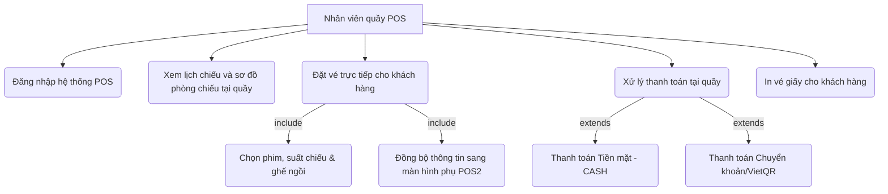

Sơ đồ Use Case chi tiết của vai trò Nhân viên (Staff):*

```mermaid
graph TD
    Staff[Nhân viên quầy POS] --> UC10(Đăng nhập hệ thống POS)
    Staff --> UC11(Xem lịch chiếu và sơ đồ phòng chiếu tại quầy)
    Staff --> UC12(Đặt vé trực tiếp cho khách hàng)
    UC12 -->|include| UC13(Chọn phim, suất chiếu & ghế ngồi)
    UC12 -->|include| UC14(Đồng bộ thông tin sang màn hình phụ POS2)
    Staff --> UC15(Xử lý thanh toán tại quầy)
    UC15 -->|extends| UC16(Thanh toán Tiền mặt - CASH)
    UC15 -->|extends| UC17(Thanh toán Chuyển khoản/VietQR)
    Staff --> UC18(In vé giấy cho khách hàng)
```
